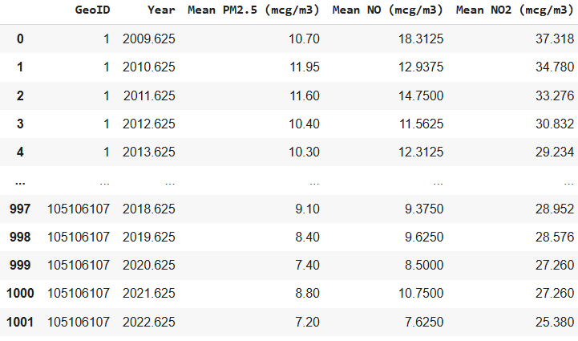
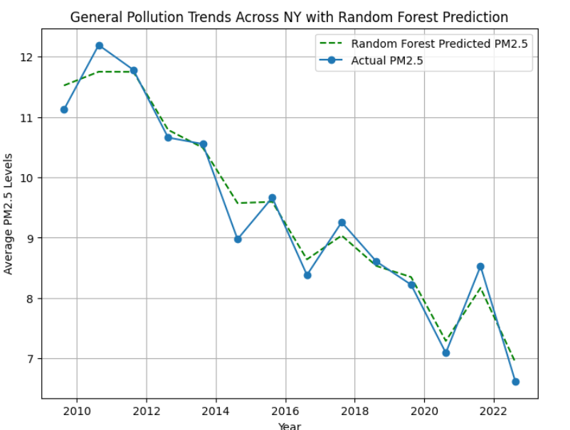
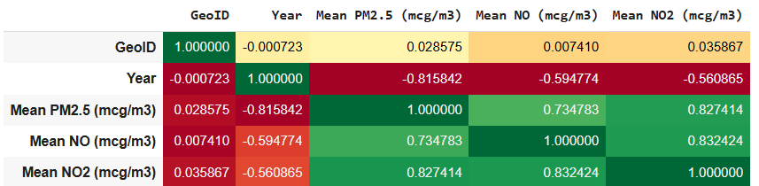
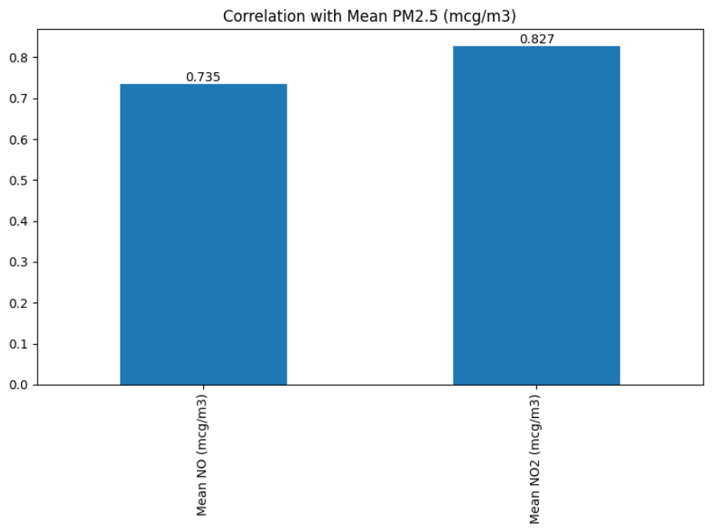
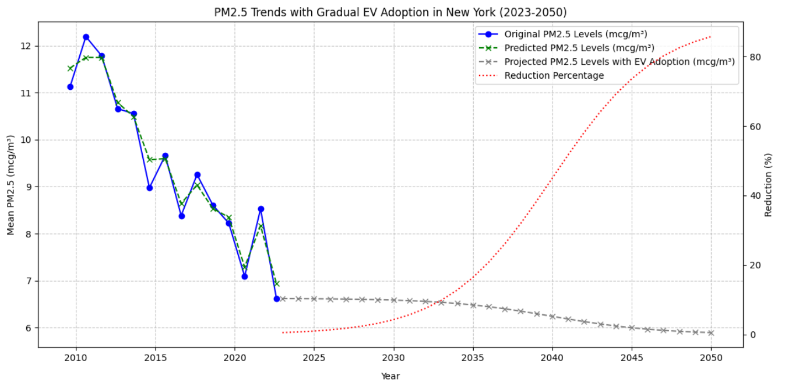

## Machine Learning Models to Analyze the Impact of Traffic Emissions on PM2.5 Levels in New York City
In order to predict the impacts traffic emission contribute to PM 2.5 urban emission in New York City, an ensemble machine learning approach is applied using random forest decision tree and correlation weighting.

## Introduction 

  Air pollution is one of the leading environmental challenges. In urban areas, traffic emissions are a primary contributor to PM2.5 levels, with pollutants like nitric oxide (NO) and nitrogen dioxide (NO2) playing key roles in the formation of secondary particulate matter, which is posing significant health risks. PM2.5 particles, which are small enough to penetrate deep into the lungs and bloodstream, are linked to respiratory and cardiovascular diseases, and even premature mortality [1].  In New York city, 14 percent of current yearly PM2.5 emission comes from local vehicle emissions, which place it as the second largest PM2.5 emission source [2]. Specifically, while researches have stated approximately that 4% to 37% of NOx, a major vehicle emission, is known to contribute to the formation of PM2.5 through chemical reactions in the atmosphere, the degree to which reducing traffic emissions might lower PM2.5 concentrations is not straightforward [3]. Traffic emissions regulation is critical for formulating effective air quality management strategies. While local vehicles are something that can go under restrictions and regulate the emission, we should regulate vehicle emissions by promoting gasoline and diesel cars and trucks into EVs. The problem relies on quantifying this relationship between traffic-related emissions and PM2.5 levels. Using machine learning can help us in understanding this problem in depth by predicting patterns and effects and therefore can inform policies aimed at reducing traffic emissions, eventually improving urban air quality.

  This project focuses on the air quality challenge in New York City, having datasets from the New York City Environmental Health Data Portal. The datasets include PM2.5, NO, and NO2 levels for 2022. By cleaning the data and using machine learning techniques, we can modelize the trends and analyze the correlations between these pollutants and predict the impact of hypothetical traffic reductions. By using models like random forest and applying correlation weighting method, we can quantify the contribution of traffic emissions to PM2.5 and simulate the effects of reduced traffic emissions, for instance, a 5%, 10%, 15% and 90% of reduction in PM2.5, NO and NO2 levels. The results showed a measurable reduction in PM2.5 levels, emphasizing the importance of managing traffic emissions for better air quality. This project in machine learning aims to provides insights of current air quality situation and predict situations under different scenarios, highlighting the value of machine learning in environmental analysis. 

  
### Links

- Code: https://colab.research.google.com/drive/1KB060R_tsXEkppfVi7MSNn2mA84aMhvV?usp=sharing
- Dataset:
- PM2.5 : https://drive.google.com/file/d/1o1ClooaRVEIVjdf0LPbrHsmJjEBvfdMG/view?usp=drive_link
- NO2   : https://drive.google.com/file/d/1Nd-4dSLHyB5qAiBMFIUNLCTntloMfRpW/view?usp=drive_link
- NO    : https://drive.google.com/file/d/16bnMVJRpuHmC4f5JNGMFJaUZ9_xEyHaG/view?usp=drive_link

### Data 

The analysis uses three datasets collected from New York City’s Environmental Health Data Portal for the year 2022:

https://a816-dohbesp.nyc.gov/IndicatorPublic/data-explorer/air-quality/?id=2023#display=summary

Figure 1: PM2.5 Dataset. Contains annual average PM2.5 concentrations (Mean mcg/m3), along with 10th percentile and 90th percentile values.

Figure 2: NO2 Dataset. Includes annual average NO2 levels (Mean ppb), 10th percentile, and 90th percentile data.

Figure 3: NO Dataset. Provides similar statistics for nitric oxide (NO), including Mean ppb, 10th percentile, and 90th percentile values.

The analysis was conducted using three key datasets representing pollution metrics in New York City: fine particles (PM2.5), nitric oxide (NO), and nitrogen dioxide (NO2). Each dataset has provided seasonal and annual averages of a specific pollutant concentrations alongside geographical identifiers in new york City. The PM2.5 dataset included columns such as GeoID (a geographical identifier), Year, and PM2.5 Levels (measured in micrograms per cubic meter, mcg/m³). Similarly, the NO and NO2 datasets contained GeoID, TimePeriod (e.g., "Summer 2022"), and respective pollutant levels (measured in ppb), along with metadata fields like Geotype and Georank.

To prepare the data for analysis, several cleaning and feature editting were performed. First, from figure 2 and 3, it was noticed that there are columns with same names, which may prone error issuses when merging data. Therefore, 'Mean ppb' columns were renamed to distinguish between the air pollutants. Irrelevant columns such as '10 th percentile', '90 percentile', 'Geography', 'Geotype' and 'Georank' were excluded to streamline the dataset. Next, the TimePeriod column was converted into numerical formats to reflect fractional years (e.g. Filter out "Annual Average", change "Summer 2022" to 2022.625). Missing values were addressed through fillna function with median, which provides a central tendency of the entire column regardless of the distribution, ensuring data continuity without introducing bias. The datasets were then merged using the GeoID column and temporal identifiers, ensuring alignment across PM2.5, NO, and NO2 measurements. Any GeoID or TimePeriod not present in all three datasets would lead to rows being excluded. Finally, unit of pollutant concentrations were standardized, with mean NO and NO2 levels converted from ppb units to micrograms per cubic meter (mcg/m³) to maintain consistency across features. 

Here is the cleaned and merged data:

Figure 4: Cleaned Dataset

The rigorous cleaning steps, combined with the requirements for alignment and consistency across datasets, result in a significantly reduced dataset size. The final dataset of 1002 rows represents only the complete, cleaned, and aggregated observations suitable for analysis.

## Modelling 

The research is data-driven. The project aimed to develop a predictive model for understanding effects of traffic emissions in particulate matter (PM2.5) concentrations in the New York City by setting up differnt reduction scenarios. The first step of modelling is to select the best model for the anlysis. 

### Prediction Regressions

Regression prediction is a powerful tool that enables the modeling of relationships between dependent variables, such as air pollutant concentration levels, and independent variables, such as time in this project. By leveraging regression, key relationships such as how variables like PM2.5, NO, and NO2 level are influenced by time trends can be identified. This understanding forms the foundation for predictive modeling, where future pollutant levels can be estimated based on historical trends and known factors.

One of the most critical benefits of regression prediction is its ability to forecast future values. For instance, this project is using regression model to predict future PM2.5 levels under differnent scenario based on historical seasonal data. Additionally, regression can quantify the impact of specific factors, such as changes in 10th Percentile NO or 90th Percentile NO2, on overall air quality, highlighting the most significant contributors to pollution.

Regression prediction is also invaluable for scenario analysis. By simulating changes in variables, such as a reduction in vehicle emissions, you can predict the resulting impact on pollutant levels. This provides a data-driven basis for evaluating the potential effectiveness of policies or interventions. Moreover, regression models continuously improve with more data, allowing for increasingly accurate predictions over time, which is essential for refining long-term strategies.

In the context of air quality analysis, regression prediction supports not only monitoring and forecasting but also decision-making and public awareness. Policymakers can use regression insights to design impactful strategies for air quality improvement. Communities can benefit from visualized trends and predictions, raising awareness about environmental issues and fostering collective action. By providing a quantitative and transparent foundation for understanding air quality trends, regression prediction ensures that decisions are informed, validated, and impactful.

The feature set for PM2.5 prediction comprises three key variables: mean NO concentration, mean NO2 concentration, and the year of measurement. The investigation utilized an ensemble machine learning methodology, implementing multiple regression techniques to identify the most effective predictive approach. Firstly, a consistent random state of 42 is implemented for effective reproducibility. Then, four regression models were systematically evaluated:

- Linear Regression: Established a baseline model to capture fundamental linear relationships between predictors and PM2.5 levels. While simple, this approach provides an initial understanding of direct correlational patterns.

- Ridge Regression: Incorporated advanced regularization techniques to mitigate overfitting and address potential multicollinearity. This method is particularly valuable in environmental datasets where predictor variables often exhibit complex interdependencies.

- Random Forest: Utilized an ensemble of decision trees to capture non-linear interactions and sophisticated patterns that linear models might overlook. This approach excels in revealing nuanced relationships hidden within complex environmental data.

- Gradient Boosting: Emerged as the most sophisticated technique, employing sequential tree-building to create a robust predictive model capable of capturing intricate relationships between pollutant variables.

Ridge Regression and Random Forest models underwent systematic hyperparameter optimization using GridSearchCV with 5-fold cross-validation. For Ridge Regression, alpha values of [0.01, 0.1, 1, 10, 100] were explored to find the optimal regularization strength. The Random Forest model was tuned by varying the number of estimators (100, 200) and maximum tree depth (5, 10, None), with the selection criterion based on R² score. The analysis of prediction models relies on the application of cross-validation techniques and hyperparameter tuning through GridSearchCV to optimize model performance and prevent overfitting.

### Performance Metrics and Model Selection 

To determine the most effective model, three key performance metrics were meticulously analyzed: 

- R² (Coefficient of Determination),
- RMSE (Root Mean Square Error), 
- MAE (Mean Absolute Error).

  
The R² metric provides insight into the proportion of variance in PM2.5 levels that can be explained by the independent variables, offering a measure of the model's explanatory power. A higher R² value indicates a more robust model that captures the underlying patterns in the data more effectively. The Root Mean Square Error (RMSE) complements this by quantifying the average magnitude of prediction errors, giving more weight to larger discrepancies and providing a nuanced view of the model's accuracy. Mean Absolute Error (MAE) offers an additional perspective by calculating the average absolute difference between predicted and actual values, which is particularly useful for understanding the model's predictive performance in a more straightforward manner.

By comparing these metrics across Linear Regression, Ridge Regression, Random Forest, and Gradient Boosting models, it is able to identify the most reliable approach for predicting urban PM2.5 concentrations. The model demonstrating the highest R² and lowest RMSE and MAE would be considered the most suitable for accurately forecasting particulate matter levels. Here is the results:

| Model               | R²       | RMSE     | MAE      |
|---------------------|----------|----------|----------|
| Linear Regression   | 0.880504 | 0.641791 | 0.540031 |
| Ridge Regression    | 0.880043 | 0.641981 | 0.540284 |
| Random Forest       | 0.978882 | 0.269798 | 0.195891 |
| Gradient Boosting   | 0.973872 | 0.300104 | 0.228590 |

Table 1: Performance Metrics Results For Regression Models Table

Linear Regression and Ridge Regression showed remarkably similar performance, with near-identical R² values around 0.88 and RMSE values approximately 0.642. These linear models explained roughly 88% of the variance in PM2.5 levels but exhibited relatively high prediction errors, suggesting limitations in capturing the complex relationships between pollutants.

While Random Forest and Gradient Boosting have demonstrated significantly improved predictive capabilities, indicating the complex non-linear prediction models have a substantial improvement over linear approaches. The Gradient Boosting model achieved an R² of 0.974, reducing the RMSE to 0.300 and the MAE to 0.229. The Gradient Boosting model further enhanced these results, achieving the highest R² of 0.979, the lowest RMSE of 0.270, and an MAE of 0.196.

Ultimately, from the metrics result table, we can conclude that the **Random Forest model** is able to explains about 97.88% of the variance in PM2.5 levels effectively, indicating a strong predictive capability and emerged as the most effective approach to accurately forecast PM2.5 concentrations. Therefore, **Random Forest** model is used for subsequent trend analysis and pollution prediction in this study below.

## Trend and Correlation Analysis and Visualization

The trend and correlation analysis can affirm us that the hypothesis that reducing traffic-related pollutants (NO, NO2) can significantly impact PM2.5 levels, supporting targeted air quality management strategies, which reducing traffic emission can reduce PM2.5 in large extend therefore should promote EVs.

The modelling begins by aggregating the dataset (final_data) by year, calculating the mean pollutant levels for each year. This creates a general_trend dataset with average values of PM2.5, NO, and NO2 across different years. Based on the results of the metric, a RandomForestRegressor model is trained using general_trend data, with Mean NO (mcg/m³), Mean NO2 (mcg/m³), and Year as features to predict Mean PM2.5 (mcg/m³). This leverages Random Forest's ability to capture complex non-linear relationships. The trained model can generate predictions for PM2.5 levels across years based on the NY portal provided pollutant data and temporal trends. These predictions represent the model's understanding of how PM2.5 levels are influenced by NO, NO2, and time.

### Current Trend Plot

Figure 5: Trend Plot of New York Air Pollutant Concentration Level (NOx and PM2.5) From 2009 to 2022

### PM2.5 Trend with Gradient Boosting Modelling Plot

Figure 6: Trend Plot of New York PM 2.5 Concentration Level From 2009 to 2022 and the Prediction Level using RandomForestRegressor Model

The first plot visualizes actual average yearly trends of PM2.5, NO, and NO2, providing a comparative overview of how the levels of each pollutant change over time and the second plot overlays the Random Forest model's predictions for PM2.5 onto the actual observed PM2.5 levels. This highlights how well the model approximates historical data trends. The first plot shows that PM2.5 levels generally trend downward over the years, likely due to regulatory efforts or changes in emissions sources. NO and NO2 trends may show similar reductions, reflecting mitigation measures for vehicle and industrial emissions. For the second plot, which applied the RandomForestRegressor model, the proximity of the predicted PM2.5 line to the actual PM2.5 line in the second plot indicates that the Random Forest model effectively captures the relationship between the predictors and PM2.5. The combined visualizations suggest that reductions in NO and NO2 levels correspond with decreases in PM2.5. The downward trend emphasizes the potential effectiveness of emissions controls in improving air quality in the recent years.

### Correlation Analysis of PM 2.5 and NOx

Correlation analysis is crucial for this project as it helps quantify the strength of the relationships between pollutants, allowing us to identify which variables have the most influence on PM2.5 levels. Understanding these relationships ensures that the most impactful features are prioritized in predictive models.

Figure 7: Correlation Heat Map 

Figure 8: Correlation with PM 2.5 Concentration Level Bar Chart

The heatmap provides a comprehensive view of how various pollutants interact, offering insights into potential causal factors and dependencies. It helps in forming hypotheses about pollution dynamics and guides targeted policy recommendations. The identified correlations can be used for feature weighting in advanced prediction models, such as weighted regression or ensemble methods. Features with stronger correlations,  NO2, can be assigned higher weights (than NO) to enhance the model's accuracy and relevance to different scenarios, for instance, the prediction factor we set up below. Incorporating correlation-based weights makes the model not only more accurate but also more interpretable, as it aligns the feature importance with observed statistical relationships. This improves the model’s predictive power and makes the results more actionable for stakeholders aiming to reduce PM2.5 levels.

The heatmap in figure 7 created using final_data.corr() visualizes the pairwise correlation between numeric features in the dataset. This allows for identifying strong linear relationships between variables, with the color gradient indicating the strength and direction of the correlation. The bar chart in figure 8 highlights the specific correlations of Mean PM2.5 (mcg/m³) with other pollutants (Mean NO (mcg/m³) and Mean NO2 (mcg/m³)), excluding features like GeoID and Year, for a focused analysis. The correlation coefficient between Mean PM2.5 (mcg/m³) and Mean NO2 (mcg/m³) is 0.827, indicating a very strong positive relationship. This suggests that higher levels of NO2 are strongly associated with elevated PM2.5 concentrations. The correlation coefficient between Mean PM2.5 (mcg/m³) and Mean NO (mcg/m³) is 0.735, which also represents a strong positive relationship. This highlights NO as another significant contributor to PM2.5 levels, though slightly less impactful than NO2. As $'NOx=NO+NO2'$ Therefore, in the following scenario prediction, a weighing of $'(Correlation of NO/(Correlation of NO + Correlation of NO2)) = (0.735/(0.827+0.735)) = 0.47'$ is applied to NO and $'(Correlation of NO2/(Correlation of NO + Correlation of NO2)) = (0.827/(0.827+0.735)) = 0.53'$ is applied to NO2.

## Prediction

The major part of the project is to identify what is the impact of reduction of traffic emission on the PM 2.5 concentration level by setting up reduction scenarios (5%, 10%, 15%, 90%) for predictions. The prediction process begins by identifying the best regression models for predicting NO and NO2 levels. The available models include Linear Regression, Ridge Regression, Random Forest Regressor, and Gradient Boosting Regressor. Similar to what I have done earlier for PM2.5, the dataset is split into training and testing subsets for NO and NO2 prediction based on the Year feature. Each model is trained and evaluated using R² as the performance metric to ensure the selection of the most accurate models for these pollutants. After identifying the best models for NO and NO2, predictions are made for future scenarios by adjusting the levels of NO and NO2 according to specified reduction factors, which are: 5%, 10%, 15%, and 90%. Additionally, based on the correlation of NOx and PM 2.5 that have been identified before, the model applied correlation weights derived from the correlation chart for NO, NO2, and PM2.5. These weights ensure that each pollutant's contribution to PM2.5 is proportionally represented in the predictions.

The model, again, used **Random Forest Regressor** to predict PM2.5 levels. This model is trained on features including Mean NO, Mean NO2, and Year to capture the complex relationships between these variables and PM2.5. The predicted reductions in NO and NO2 are combined into a weighted NOx metric. The correlation weights ensure the combined metric reflects the relative influence of each pollutant on PM2.5 formation. Mentioned in the introduction, 14 percent of current yearly PM2.5 emission comes from local vehicle emissions. Therefore, the contribution of traffic emissions to PM2.5 levels is factored in by calculating 14% of the original PM2.5 concentration, which provides a baseline for assessing the impact of emission reduction strategies. Similar, the contribution of NOx to PM2.5 is calculated using the weighted NOx metric and a predefined 5% contribution factor. This quantifies how changes in NOx levels directly affect PM2.5.

For each reduction scenario, adjusted NO and NO2 levels are input into the PM2.5 prediction model. This generates new PM2.5 estimates under each hypothetical scenario. The predicted PM2.5 reductions are compared to the original PM2.5 levels to calculate the percentage reduction achieved in each scenario. This helps evaluate the effectiveness of emission reduction measures. The results include the original PM2.5 concentration, predicted PM2.5 levels, predicted NO and NO2 levels, traffic-related PM2.5 contributions, and the total percentage reduction in PM2.5.  It is expected that the total reduction percentage should be larger as the reduction factor increases, but less than 14%. 

### Calculation and Result

The calculation uses the weighted contributions of NO and NO2 (combined as NOx) to determine their impact on PM2.5 levels. Correlation weights are applied to NO and NO2 to compute a weighted NOx value that reflects their influence on PM2.5. The contribution of NOx to PM2.5 is calculated as 5% of this weighted NOx, aligning with the theory that around 5% of NOx contributes to secondary PM2.5 formation through atmospheric chemical reactions.  For each reduction scenario, the levels of NO and NO2 are reduced by the specified factor (e.g., 5%, 10%, 15%, and 90%) to simulate the effects of emission reductions. Adjusted levels are input into the Random Forest model to predict the corresponding PM2.5 levels. The total reduction percentage is then calculated as:

$Total Reduction(%)= Original PM2.5 − ( Traffic PM2.5 Contribution + NOx Contribution to PM2.5 ) Original PM2.5 * 100$

| Reduction Factor (%) | Original PM2.5 (mcg/m³) | Predicted PM2.5 (mcg/m³) | Predicted NO (mcg/m³) | Predicted NO2 (mcg/m³) | NOx Contribution to PM2.5 (mcg/m³) | Total PM2.5 Reduction (%) |
|-----------------------|-------------------------|---------------------------|------------------------|-------------------------|------------------------------------|---------------------------|
| 5.0                  | 9.39506                | 9.212186                 | 12.105971             | 28.596058              | 1.041995                           | 2.909113                  |
| 10.0                 | 9.39506                | 9.049776                 | 11.468814             | 27.091002              | 0.987154                           | 3.492844                  |
| 15.0                 | 9.39506                | 8.812774                 | 10.831658             | 25.585946              | 0.932312                           | 4.076575                  |
| 90.0                 | 9.39506                | 8.158392                 | 1.274313              | 3.010111               | 0.109684                           | 12.832538                 |

Table 3: Result Table for Reduction Prediction under Different Scenarios( 5%, 10%, 15%, and 90%)

For each scenario, the table records the original PM2.5 concentration, the predicted PM2.5 levels after reductions, the adjusted NO and NO2 values, the computed NOx Contribution to PM2.5, and the overall percentage reduction. For instance, at a 5% reduction factor, the original PM2.5 level of 9.39506 mcg/m³ reduces to 9.212186 mcg/m³, with a corresponding NOx Contribution to PM2.5 of 1.041995 mcg/m³, resulting in a total reduction of 2.91%.  For example, a 90% reduction factor results in a NOx Contribution to PM2.5 of just 0.109684 mcg/m³, yielding a total PM2.5 reduction of 12.83%. The table sucessfully shown how increasing reduction factors lead to greater decreases in PM2.5 levels. These calculations underscore the potential effectiveness of emission reduction policies and the importance of accounting for weighted pollutant contributions when modeling air quality improvements.

Figure 9: Projected Trend Plot (Assume 2050, 90% factor) 

## Conclusion 

The project is considered successful as the total reduction percentage should be larger as the reduction factor increases, but less than 14% for the 90% prediction result. The project can effectively integrates correlation-based weighting and advanced machine learning models to predict air pollution trends and evaluate the impact of emission reduction scenarios in New York City. By using Random Forest for PM2.5 prediction and carefully selecting models for NO and NO2, the analysis achieves accurate predictions that align with observed relationships. The application of correlation weights ensures that NOx contributions to PM2.5 are realistically represented, offering actionable insights into the formation of secondary pollutants. Reduction scenarios demonstrate significant potential for improving air quality, with reductions in NOx leading to measurable decreases in PM2.5 levels. The final result table highlights the effect of various reduction factors, such as the notable 12.83% total PM2.5 reduction achieved under a 90% NOx reduction scenario. This emphasizes the importance of targeted emission control strategies for improving public health and urban environments. The methodology provides a robust framework for assessing pollution dynamics and the efficacy of interventions, supporting data-driven environmental policy development.

## Discussion

Although the prediction is considered successful, several areas warrant further exploration to enhance the accuracy and applicability of these predictions.

Firstly, the complexity of atmospheric conditions should be incorporated into future models. Thermodynamics variables such as wind direction, wind speed, atmospheric pressure, and the presence of inversion layers significantly influence the dispersion and concentration of pollutants. For instance, wind direction can transport emissions from other regions, impacting local air quality. Similarly, atmospheric pressure and inversion layers can trap pollutants close to the ground, exacerbating PM2.5 concentrations.[4] Including these factors would require coupling machine learning models with meteorological data, potentially improving predictions and providing region-specific insights. Emission factors should be refined to account for variations based on wind direction and other meteorological conditions. Current models assume a uniform contribution of NOx to PM2.5, but this simplification overlooks the dynamic nature of chemical reactions in the atmosphere. Incorporating wind-adjusted emission factors could offer a more accurate representation of pollutant behavior and their contribution to secondary PM2.5 formation. 

Additionally, for future research, we can integrate health impact models with air pollution predictions. Machine learning can be utilized to link PM2.5 exposure levels to health outcomes, such as respiratory and cardiovascular diseases. By combining pollution data with health records and population demographics, models can predict the potential health benefits of various emission reduction strategies. Such analyses would provide policymakers with a more holistic understanding of the socio-economic benefits of improving air quality. Real-time air quality monitoring and satellite data integration can complement the existing dataset. These sources provide high-resolution temporal and spatial data, capturing fluctuations in pollution levels more effectively than annual averages. Incorporating such data would enhance the robustness of the predictions and enable dynamic scenario modeling.

While the current study focuses on NO and NO2 as primary contributors to PM2.5, it is essential to address broader concerns related to environmental injustice, environmental health, and climate change. Marginalized communities often bear the disproportionate burden of air pollution, facing higher exposure levels and associated health risks.[5] Integrating these dimensions into future models can help highlight disparities and support targeted interventions to achieve environmental equity. Additionally, understanding the interplay between air pollution and climate change is crucial, as pollutants like NOx and PM2.5 contribute to global warming and exacerbate climate-related health issues. Exploring the roles of other pollutants, such as volatile organic compounds (VOCs) and sulfur dioxide (SO2), could further refine the model to provide a more comprehensive view of air pollution dynamics and their broader implications.[6] These pollutants also play critical roles in secondary PM2.5 formation and should be included in future analyses to provide a more comprehensive view of air pollution dynamics.

## References
[1] The New York City Community Air Survey, Neighborhood Air Quality 2008-2019
https://nyccas.cityofnewyork.us/nyccas2021v9/report/2#:~:text=Fuel%20combustion%20in%20vehicles%2C%20boilers,common%20sources%20of%20PM2.5

[2] The public health impacts of PM2.5 from traffic air pollution, Environmental Data Portal, New York Government
https://a816-dohbesp.nyc.gov/IndicatorPublic/data-stories/traffic-and-air-pollution/

[3] William M. Hodan, William R. Barnard, Evaluating the Contribution of PM2.5 Precursor Gases and Re-entrained Road Emissions to Mobile Source PM2.5 Particulate Matter Emissions 
https://www3.epa.gov/ttnchie1/conference/ei13/mobile/hodan.pdf

[4] How Weather Affects Air Quality, *Center for Science Education*
https://scied.ucar.edu/learning-zone/air-quality/how-weather-affects-air-quality

[5] Rahanna N. Khan, Antonio F. Saporito, Traffic-related air pollution in marginalized neighborhoods: a community perspective (2024)
https://www.tandfonline.com/doi/full/10.1080/08958378.2024.2331259

[6] Wei Wei, Saisai Chen, Yue Wang, The impacts of VOCs on PM2.5 increasing via their chemical losses estimates: A case study in a typical industrial city of China, *ScienceDirect* (2022) 
https://www.sciencedirect.com/science/article/pii/S1352231022000437

### *Thank You for Reading ;)*
