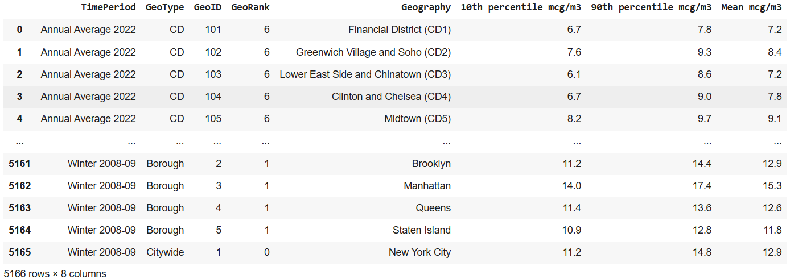
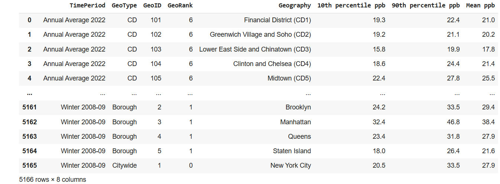
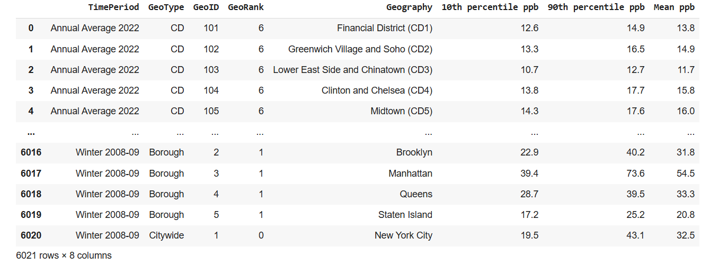
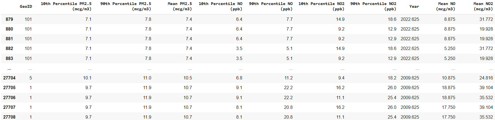
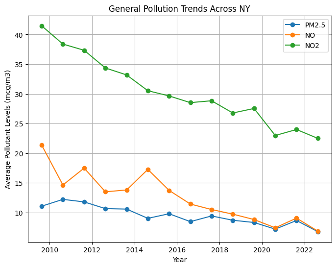
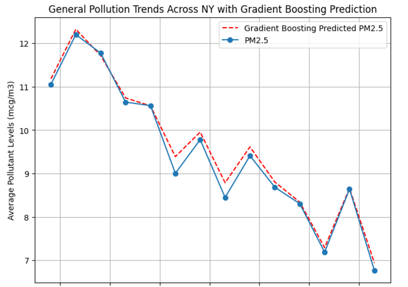
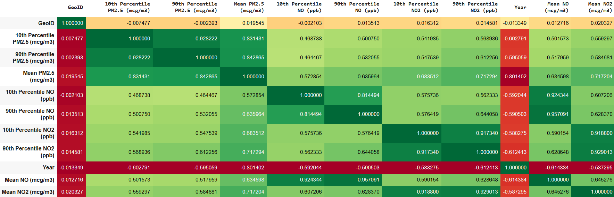
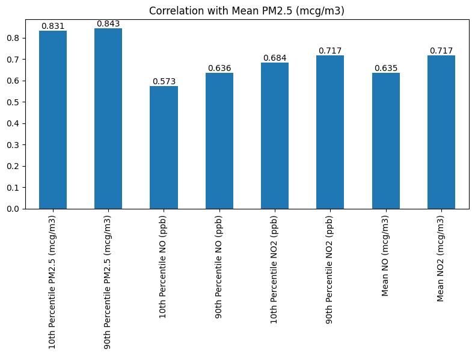

## Machine Learning Models to Analyze the Impact of Traffic Emissions on PM2.5 Levels in New York City
To predict PM2.5 levels in urban environments, an ensemble machine learning approach is applied using linear regression, ridge regression, random forest, and gradient boosting decision trees.

## Introduction 

  Air pollution is one of the leading environmental challenges. In urban areas, traffic emissions are a primary contributor to PM2.5 levels, with pollutants like nitric oxide (NO) and nitrogen dioxide (NO2) playing key roles in the formation of secondary particulate matter, which is posing significant health risks. PM2.5 particles, which are small enough to penetrate deep into the lungs and bloodstream, are linked to respiratory and cardiovascular diseases, and even premature mortality [1].  In New York city, 14 percent of current PM2.5 concentration comes from local vehicle emissions, which place it as the second largest PM2.5 emission source [2]. Specifically, while researches have stated that 4% to 37% of NOx, a major vehicle emission, is known to contribute to the formation of PM2.5 through chemical reactions in the atmosphere, the degree to which reducing traffic emissions might lower PM2.5 concentrations is not straightforward [3]. Traffic emissions regulation is critical for formulating effective air quality management strategies. While local vehicles are something that can go under restrictions and regulate the emission, we can regulate vehicle emissions by turning gasoline and diesel cars into EVs. The problem relies on quantifying this relationship between traffic-related emissions and PM2.5 levels. Using machine learning can help us in understanding this problem in depth by predicting patterns and effects and therefore can inform policies aimed at reducing traffic emissions, eventually improving urban air quality.

  This project focuses on the air quality challenge in New York City. We have datasets from the New York City Environmental Health Data Portal [4]. The datasets include PM2.5, NO, and NO2 levels for 2022. By cleaning the data and using machine learning techniques, we can modelize the trends and analyze the correlations between these pollutants and predict the impact of hypothetical traffic reductions. By using models like linear regression and gradient boosting and applying weighting method, we can quantify the contribution of traffic emissions to PM2.5 and simulate the effects of reduced traffic emissions, for instance, a 5%, 10%, 15% and 90% of reduction in PM2.5, NO and NO2 levels. The results showed a measurable reduction in PM2.5 levels, emphasizing the importance of managing traffic emissions for better air quality. This project in machine learning aims to provides insights of current air quality situation and predict situations under different scenarios, highlighting the value of machine learning in environmental analysis.

### Links

- Code: https://colab.research.google.com/drive/1KB060R_tsXEkppfVi7MSNn2mA84aMhvV?usp=sharing
- Dataset:
- PM2.5 : https://drive.google.com/file/d/1o1ClooaRVEIVjdf0LPbrHsmJjEBvfdMG/view?usp=drive_link
- NO2   : https://drive.google.com/file/d/1Nd-4dSLHyB5qAiBMFIUNLCTntloMfRpW/view?usp=drive_link
- NO    : https://drive.google.com/file/d/16bnMVJRpuHmC4f5JNGMFJaUZ9_xEyHaG/view?usp=drive_link

### Data 

The analysis uses three datasets collected from New York City’s Environmental Health Data Portal for the year 2022:

https://a816-dohbesp.nyc.gov/IndicatorPublic/data-explorer/air-quality/?id=2023#display=summary

Figure 1: PM2.5 Dataset. Contains annual average PM2.5 concentrations (Mean mcg/m3), along with 10th percentile and 90th percentile values.

Figure 2: NO2 Dataset. Includes annual average NO2 levels (Mean ppb), 10th percentile, and 90th percentile data.

Figure 3: NO Dataset. Provides similar statistics for nitric oxide (NO), including Mean ppb, 10th percentile, and 90th percentile values.

The analysis was conducted using three key datasets representing pollution metrics in New York City: fine particles (PM2.5), nitric oxide (NO), and nitrogen dioxide (NO2). Each dataset has provided seasonal and annual averages of a specific pollutant concentrations alongside geographical identifiers in new york City. The PM2.5 dataset included columns such as GeoID (a geographical identifier), Year, and PM2.5 Levels (measured in micrograms per cubic meter, mcg/m³). Similarly, the NO and NO2 datasets contained GeoID, TimePeriod (e.g., "Summer 2022"), and respective pollutant levels (measured in ppb), along with metadata fields like Geotype and Georank.

To prepare the data for analysis, several cleaning and feature editting were performed. First, irrelevant columns such as Geography, Geotype and Georank were excluded to streamline the dataset. Next, the TimePeriod column was converted into numerical formats to reflect fractional years (e.g. Filter out "Annual Average", change "Summer 2022" to 2022.625). Missing values were addressed through fillna function with median, which provides a central tendency of the entire column regardless of the distribution, ensuring data continuity without introducing bias. The datasets were then merged using the GeoID column and temporal identifiers, ensuring alignment across PM2.5, NO, and NO2 measurements. Duplicated data with same GeoID and Year after merging are filtered out. Finally, unit of pollutant concentrations were standardized, with mean NO and NO2 levels converted from ppb units to micrograms per cubic meter (mcg/m³) to maintain consistency across features. 

Here is the cleaned and merged data:

Figure 4: Cleaned Dataset

## Modelling 

The research is data-driven. The project aimed to develop a predictive model for understanding effects of traffic emissions in particulate matter (PM2.5) concentrations in the New York City by setting up differnt reduction scenarios. The first step of modelling is to select the best model for the anlysis. 

### Prediction Regressions

Regression prediction is a powerful tool that enables the modeling of relationships between dependent variables, such as air pollutant concentration levels, and independent variables, such as time in this project. By leveraging regression, key relationships such as how variables like PM2.5, NO, and NO2 level are influenced by time trends can be identified. This understanding forms the foundation for predictive modeling, where future pollutant levels can be estimated based on historical trends and known factors.

One of the most critical benefits of regression prediction is its ability to forecast future values. For instance, this project is using regression model to predict future PM2.5 levels under differnent scenario based on historical seasonal data. Additionally, regression can quantify the impact of specific factors, such as changes in 10th Percentile NO or 90th Percentile NO2, on overall air quality, highlighting the most significant contributors to pollution.

Regression prediction is also invaluable for scenario analysis. By simulating changes in variables, such as a reduction in vehicle emissions, you can predict the resulting impact on pollutant levels. This provides a data-driven basis for evaluating the potential effectiveness of policies or interventions. Moreover, regression models continuously improve with more data, allowing for increasingly accurate predictions over time, which is essential for refining long-term strategies.

In the context of air quality analysis, regression prediction supports not only monitoring and forecasting but also decision-making and public awareness. Policymakers can use regression insights to design impactful strategies for air quality improvement. Communities can benefit from visualized trends and predictions, raising awareness about environmental issues and fostering collective action. By providing a quantitative and transparent foundation for understanding air quality trends, regression prediction ensures that decisions are informed, validated, and impactful.

The feature set for PM2.5 prediction comprises three key variables: mean NO concentration, mean NO2 concentration, and the year of measurement. The investigation utilized an ensemble machine learning methodology, implementing multiple regression techniques to identify the most effective predictive approach. Firstly, a consistent random state of 42 is implemented for effective reproducibility. Then, four regression models were systematically evaluated:

- Linear Regression: Established a baseline model to capture fundamental linear relationships between predictors and PM2.5 levels. While simple, this approach provides an initial understanding of direct correlational patterns.

- Ridge Regression: Incorporated advanced regularization techniques to mitigate overfitting and address potential multicollinearity. This method is particularly valuable in environmental datasets where predictor variables often exhibit complex interdependencies.

- Random Forest: Utilized an ensemble of decision trees to capture non-linear interactions and sophisticated patterns that linear models might overlook. This approach excels in revealing nuanced relationships hidden within complex environmental data.

- Gradient Boosting: Emerged as the most sophisticated technique, employing sequential tree-building to create a robust predictive model capable of capturing intricate relationships between pollutant variables.

Ridge Regression and Random Forest models underwent systematic hyperparameter optimization using GridSearchCV with 5-fold cross-validation. For Ridge Regression, alpha values of [0.01, 0.1, 1, 10, 100] were explored to find the optimal regularization strength. The Random Forest model was tuned by varying the number of estimators (100, 200) and maximum tree depth (5, 10, None), with the selection criterion based on R² score. The analysis of prediction models relies on the application of cross-validation techniques and hyperparameter tuning through GridSearchCV to optimize model performance and prevent overfitting.

### Performance Metrics and Model Selection 

To determine the most effective model, three key performance metrics were meticulously analyzed: 

- R² (Coefficient of Determination),
- RMSE (Root Mean Square Error), 
- MAE (Mean Absolute Error).

  
The R² metric provides insight into the proportion of variance in PM2.5 levels that can be explained by the independent variables, offering a measure of the model's explanatory power. A higher R² value indicates a more robust model that captures the underlying patterns in the data more effectively. The Root Mean Square Error (RMSE) complements this by quantifying the average magnitude of prediction errors, giving more weight to larger discrepancies and providing a nuanced view of the model's accuracy. Mean Absolute Error (MAE) offers an additional perspective by calculating the average absolute difference between predicted and actual values, which is particularly useful for understanding the model's predictive performance in a more straightforward manner.

By comparing these metrics across Linear Regression, Ridge Regression, Random Forest, and Gradient Boosting models, it is able to identify the most reliable approach for predicting urban PM2.5 concentrations. The model demonstrating the highest R² and lowest RMSE and MAE would be considered the most suitable for accurately forecasting particulate matter levels. Here is the results:

| Model               | R²       | RMSE     | MAE      |
|---------------------|----------|----------|----------|
| Linear Regression   | 0.732425 | 0.826285 | 0.643181 |
| Ridge Regression    | 0.732441 | 0.826260 | 0.643223 |
| Random Forest       | 0.876806 | 0.560663 | 0.387460 |
| Gradient Boosting   | 0.879560 | 0.554362 | 0.391434 |

Table 1: Performance Metrics Results For Regression Models Table

Linear Regression and Ridge Regression showed remarkably similar performance, with near-identical R² values around 0.732 and RMSE values approximately 0.826. These linear models explained roughly 73% of the variance in PM2.5 levels but exhibited relatively high prediction errors, suggesting limitations in capturing the complex relationships between pollutants.

While Random Forest and Gradient Boosting have demonstrated significantly improved predictive capabilities. The Random Forest model achieved an R² of 0.877, reducing the RMSE to 0.561 and the MAE to 0.387, indicating a substantial improvement over linear approaches. The Gradient Boosting model further enhanced these results, achieving the highest R² of 0.880, the lowest RMSE of 0.554, and an MAE of 0.391.

Ultimately, from the metrics result table, we can conclude that the **Gradient Boosting model** is able to explains about 87.96% of the variance in PM2.5 levels effectively, indicating a strong predictive capability and emerged as the most effective approach to accurately forecast PM2.5 concentrations. Therefore, Gradient Boosting model is used for subsequent trend analysis and pollution prediction in this study below.

## Visualization and Trend Analysis

### Trend Plot

Figure 5: Trend Plot of New York Air Pollutant Concentration Level (NOx and PM2.5) From 2009 to 2022

### PM2.5 Trend with Gradient Boosting Modelling Plot

Figure 6: Trend Plot of New York PM 2.5 Concentration Level From 2009 to 2022 and the Prediction Level using Gradient Boosting 

### Correlation Analysis of PM 2.5 and NOx

Figure 7: Correlation Graph for All Features 

Figure 8: Correlation with PM 2.5 Concentration Level Bar Chart

## Prediction

Table 2:

Table 3: 

## Guide to Adding Content
* Your repository's `README.md` file (the file you are reading now) acts like a home page. Replace its contents with whatever you want the world to see by editing the file on GitHub.
* If you want to turn this page into a CV or blog, etc., it may be useful to refer to a [guide for writing Markdown](https://www.markdownguide.org/basic-syntax/).
* You can create other markdown files (.md) in your repository and navigate to them from this page using links, i.e.: [here is a link to another file, `project.md`](project.md)
* When editing a markdown file on GitHub, it is useful to wrap text by selecting the *Soft wrap* option as shown: 
* If you want to get even more technical, you can also write HTML in your .md files, and GitHub Pages will render it. For example, the image below is displayed by writing the following (edit this file to see!): ``
 

***

## Delivering your Project

Your final project is delivered in two components: a report and your code.

### Report

Your report should be **delivered via your website**. Submit a link to your website on BruinLearn so that your instructor can browse it to find your report. 

To make this simple, you can write the report using a word processor or Latex, then export it as a .pdf file and upload it to the `assets` directory. You can then link to it [like so](/assets/project_demo.pdf). However, you can also type the report directly onto the website using another markdown page - [here is](/project.md) a template for that.

### Code

A link to your code must be submitted on BruinLearn, and the course instructor must be able to download your code to mark it. The code could be in a Google Colab notebook (make sure to *share* the notebook so access is set to **Anyone with the link**), or you could upload the code into a separate GitHub repository, or you could upload the code into the `assets` directory of your website and link to it. 
